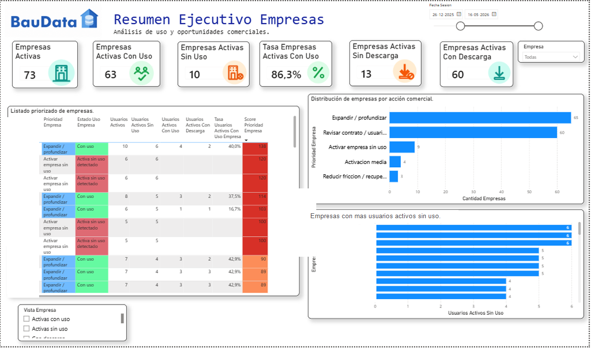
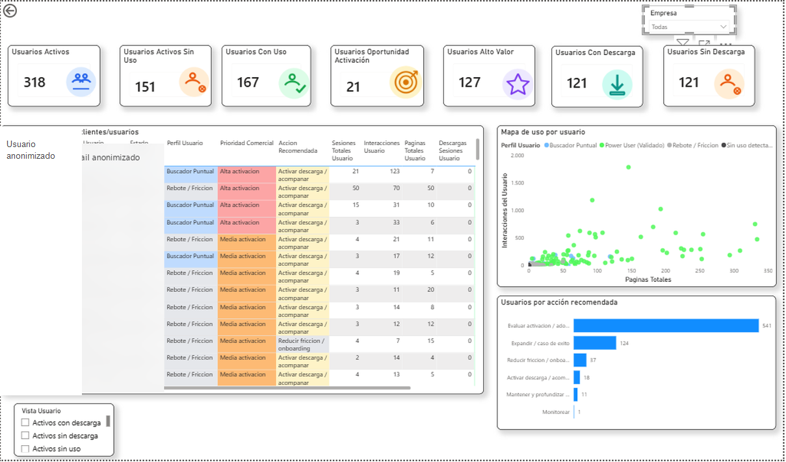

# BauData B2B Usage Analytics & Behavioral Segmentation

End-to-end product analytics project that transforms PostHog behavioral telemetry into a commercial prioritization system for BauData, a B2B platform.

The project evolved from user clustering into an operational Power BI dashboard for account management: which companies are adopting the product, where usage is missing, which users explain the opportunity, and what commercial action should follow.

## Dashboard Preview

### Executive Account View



### User Action View



Screenshots are anonymized where user-level identifiers appear. Raw customer data, e-mails, exports, and Power BI files with embedded data remain private.

## Business Value

The dashboard helps the commercial team move from raw usage data to a concrete operating rhythm:

- identify active companies with and without detected product usage;
- separate accounts with usage from accounts with stronger conversion signals such as downloads;
- detect active users who are not using the platform;
- find users who explore but do not complete the expected value action;
- rank companies and users by commercial priority;
- translate behavioral segments into recommended actions such as activation, onboarding, recovery, maintenance, or expansion.

In business terms, the project answers:

> Which accounts and users should we look at first, why, and what should we do next?

## Current Dashboard Logic

The final dashboard is organized around two business-facing pages.

### 1. Resumen Ejecutivo Empresas

Account-level view for commercial leadership.

Main KPIs:

- active companies;
- active companies with usage;
- active companies without detected usage;
- active companies without downloads;
- active companies with downloads;
- active-company usage rate.

This page is designed for account prioritization. The table and slicer can switch between all companies, prioritized companies, active companies with usage, active companies without usage, companies without downloads, and companies with downloads.

### 2. Accion Comercial Usuarios

User-level view for concrete follow-up.

Main KPIs:

- active users;
- active users without detected usage;
- users with usage;
- users with activation opportunity;
- high-value users;
- active users with downloads;
- active users without downloads.

This page connects behavioral evidence with specific commercial actions. It supports filtering users by active status, no usage, usage, activation opportunity, high value, downloads, and no downloads.

## Analytical Pipeline

```text
PostHog events and sessions
        |
        v
Historical local extraction
        |
        v
Session and user feature engineering
        |
        v
K-Means clustering and model comparison
        |
        v
User-level commercial scoring
        |
        v
Company-level B2B summary
        |
        v
Power BI dashboard for commercial decision-making
```

## Modeling Decision

The project uses K-Means with K3 as the final segmentation baseline. The choice favors interpretability and commercial usability over marginal improvements in internal clustering metrics.

The clustering layer is not the final product by itself. It supports the commercial layer by helping describe behavior in simple terms:

- power users;
- search/exploration users;
- rebound/friction users;
- users without detected usage.

## Commercial Scoring

The scoring layer combines usage and business signals:

- active users without usage;
- activation opportunity;
- recovery/friction patterns;
- high-value usage;
- downloads as a proxy for conversion;
- account-level aggregation for prioritization.

Downloads are treated as an initial proxy of product value because BauData users often download information to share or use internally. The logic is intentionally adjustable if the business later defines additional value actions.

## Key Findings From The Latest Local Run

The current pipeline processed historical platform usage from PostHog and connected it with BauData's company/user master data. Exact operational counts remain private, but the refresh validated two commercially relevant realities:

1. Some active customer accounts have users who are registered but are not showing detected platform usage, creating an adoption and onboarding opportunity.
2. Identity resolution is a meaningful product analytics risk: many PostHog identifiers are technical IDs rather than e-mails, so part of the activity cannot yet be safely assigned to a company.

## Repository Structure

```text
.
|-- scripts/
|   |-- posthog_historico_local.py
|   |-- modeloml_baudata_local.py
|   |-- comparar_modelos_clustering.py
|   |-- crear_analisis_empresas.py
|   `-- actualizar_baudata.ps1
|-- docs/
|   |-- assets/
|   |   |-- dashboard_empresas_sanitizado.png
|   |   `-- dashboard_usuarios_sanitizado.png
|   |-- DATA_REQUIREMENTS.md
|   |-- POWERBI_DASHBOARD_GUIDE.md
|   `-- PROJECT_OVERVIEW.md
|-- Actualizar_BauData.cmd
|-- requirements.txt
`-- README.md
```

## Local Refresh

```powershell
python -m venv .venv
.\.venv\Scripts\Activate.ps1
pip install -r requirements.txt
.\Actualizar_BauData.cmd
```

After the local pipeline finishes, refresh the Power BI model manually from:

```text
Inicio > Actualizar
```

## Data Privacy

This repository excludes private operational data:

- raw PostHog exports;
- company/user master files;
- generated CSV outputs with customer information;
- PBIX files with embedded private data;
- logs and credentials;
- user e-mails and customer-level sensitive details.

The screenshots included here are presentation assets, not raw data exports.

## Tools

Python, pandas, scikit-learn, Power BI, DAX, PostHog, Excel, PowerShell.

## Role

Product and Behavioral Data Analyst: data extraction, feature engineering, segmentation, B2B modeling, dashboard design, commercial scoring, documentation, and stakeholder-oriented storytelling.
